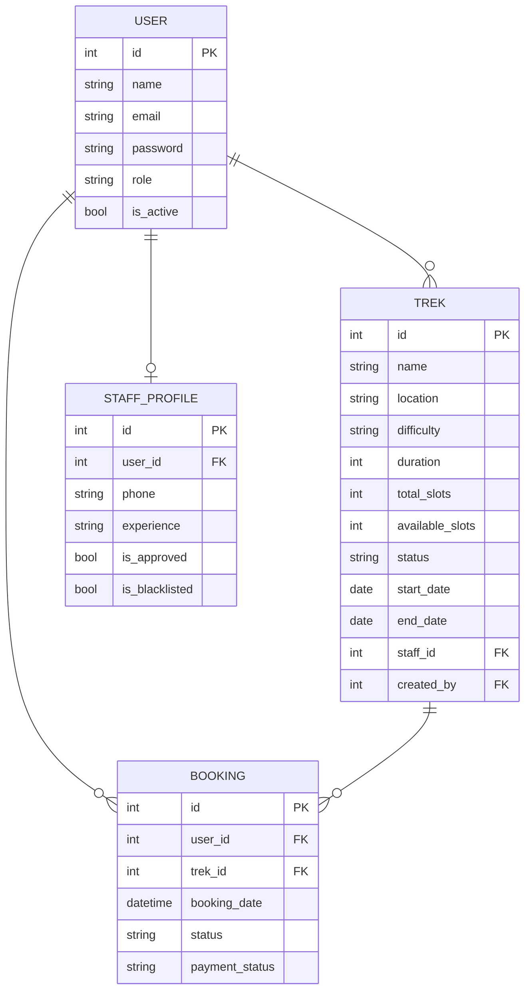

This application makes planning treks easy(Trail Quest).
# ER Diagram

```mermaid
erDiagram
    USER ||--o{ BOOKING : ""
    TREK ||--o{ BOOKING : ""
    USER ||--o{ TREK : ""
    USER ||--o| STAFF_PROFILE : ""

    USER {
        int id PK
        string name
        string email
        string password
        string role
        bool is_active
    }
    TREK {
        int id PK
        string name
        string location
        string difficulty
        int duration
        int total_slots
        int available_slots
        string status
        date start_date
        date end_date
        int staff_id FK
        int created_by FK
    }
    BOOKING {
        int id PK
        int user_id FK
        int trek_id FK
        datetime booking_date
        string status
        string payment_status
    }
    STAFF_PROFILE {
        int id PK
        int user_id FK
        string phone
        string experience
        bool is_approved
        bool is_blacklisted
    }
```